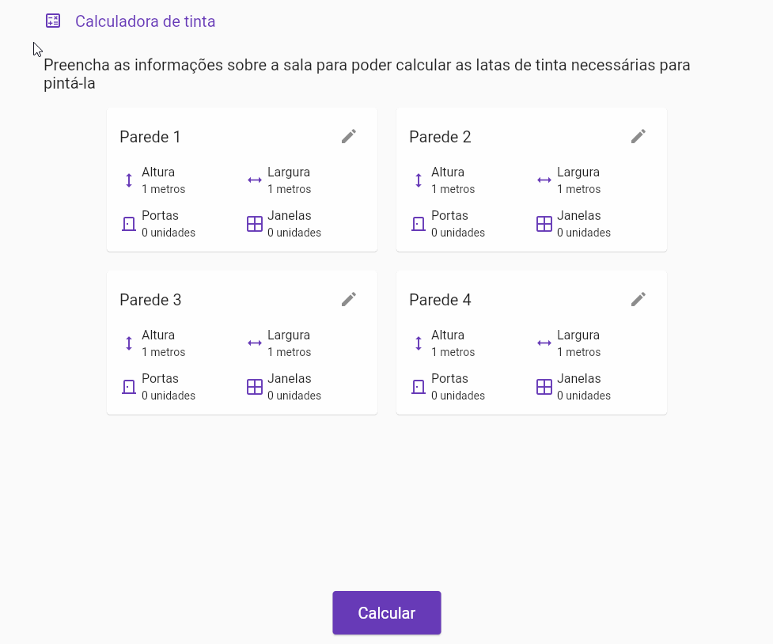
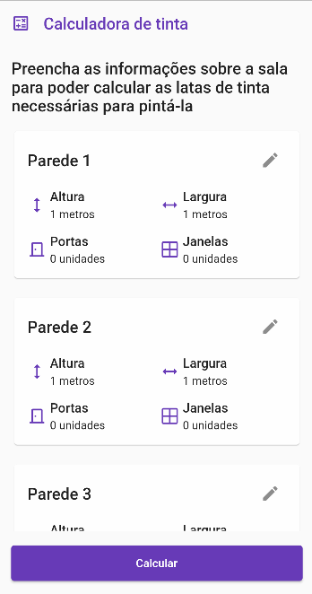
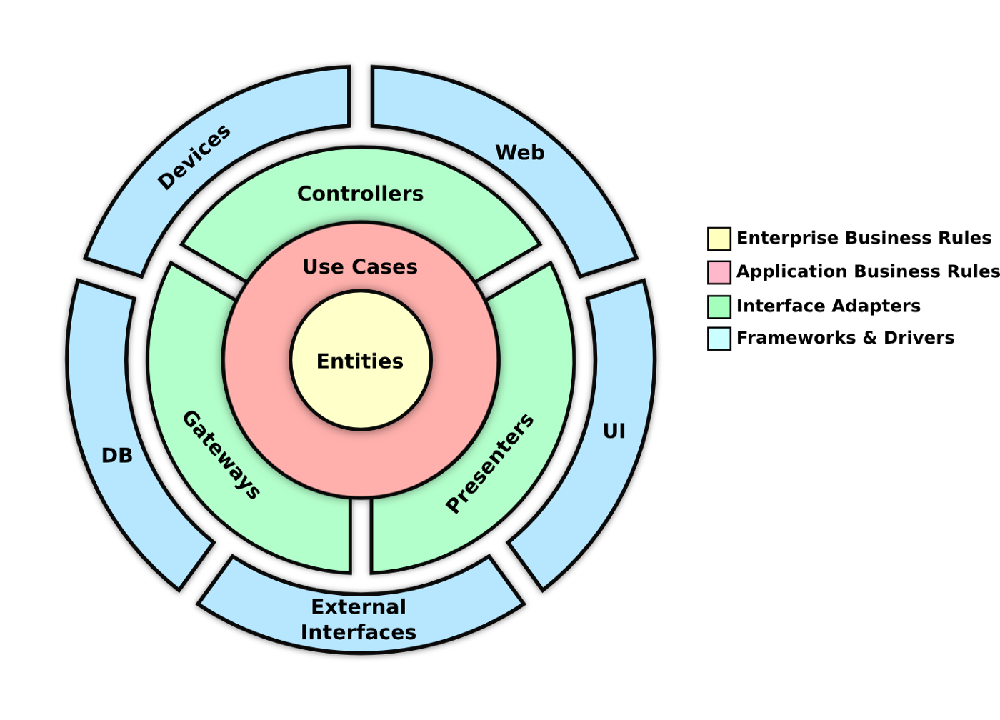

# Paint Calculator

Aplicação criada para calcular a quantidade de baldes de tinta utilizadas para pintar uma sala.

- [Demonstração](#demonstração)
- [Regras de negócio](#regras-de-negócio)
- [Como executar](#como-executar)
- [Arquitetura e estrutura de código](#arquitetura-e-estrutura-de-código)

# Demonstração

## Versão Web

## Versão Android

# Regras de negócio

O usuário irá informar o tamanho de 4 paredes de uma sala, juntamente com a quantidade de portas e janelas em cada parede. A partir disso, será calculada a quantidade de tinta utilizada para pintar as paredes considerando:

- Cada litro de tinta é capaz de pintar 5 metros quadrados;
- Cada janela possui as medidas: 2,00 x 1,20 metros;
- Cada porta possui as medidas: 0,80 x 1,90 metros.

O resultado será retornado em latas de tinta, sendo os possíveis tamanhos: 0,5 L, 2,5 L, 3,6 L, 18 L.

Exemplo: Se o usuário precisar de 19 litros de tinta, o resultado do cálculo deverá ser de 1 lata de 18 litros e 2 latas de 0,5 litros.

**Validações de dados**

- Nenhuma parede pode ter menos de 1 metro quadrado nem mais de 15 metros quadrados, mas podem possuir alturas e larguras diferente;
- O total de área das portas e janelas deve ser no máximo 50% da área de parede;
- A altura de paredes com porta deve ser, no mínimo, 30 centímetros maior que a altura da porta.

# Como executar

A aplicação pode ser acessada de 3 formas: acesso pela URL pública, execução com Docker ou execução com Flutter.

## Acesso por URL pública

Para acessar a aplicação pela sua URL pública, basta acessar https://paintcalculator.gustavohill.dev. 
Observação: Essa é a aplicação web, caso deseje acessar a aplicação Android deverá usar a [execução com Flutter](#execução-com-flutter).

## Execução com Docker

Para a execução com Docker você precisará ter [Docker](https://www.docker.com) e [Docker Compose](https://docs.docker.com/compose/) instalados no seu ambiente. 
Para executar a aplicação basta executar o comando `make docker_start` ou `docker-compose up`, após isso será buildada a imagem do Docker e executada em seguida. A aplicação estará disponível na porta 5000. 
Para finalizar a aplicação basta executar o comando `make docker_stop` ou `docker-compose down`. 
Observação: Essa é a aplicação web, caso deseje acessar a aplicação Android deverá usar a [execução com Flutter](#execução-com-flutter).

## Execução com Flutter

Para a execução com Flutter você precisará ter [Flutter](https://flutter.dev/) instalado no seu ambiente. 
Para executar a aplicação basta executar o comando `flutter run` no seu terminal.  
Caso deseje, você pode especificar um dispositivo onde a aplicação será executada usando o comando `flutter run -d ${device}`, onde `device` é o dispositivo em questão, por exemplo, `flutter run -d chrome`. Para obter os dispositivos disponíveis use o comando `flutter devices`.

# Arquitetura e estrutura de código

A arquitetura da aplicação é baseada nos conceitos de Arquitetura Limpa, onde cada módulo é divido em camadas. 
Basicamente, a camada mais baixa trata das entidades e regras de negócio, e as camadas superiores tratam de preocupações "exteriores" (interface, banco de dados, infraestrutura, etc). As camadas se comunicam sempre de cima para baixo, então as camadas superiores conhecem as inferiores mas as inferiores não conhecem as superiores. A comunicação é feita através de contratos definidos em cada camada, e que a camada superior implementa, visando o desacoplamento e testabilidade das camadas. 

## Camadas

- **Domain**: Camada de domínio do módulo, contém as entidades utilizadas, classes de erro e casos de uso. Cada caso de uso deve possuir uma classe definindo o contrato e outra implementando;
- **Presenter**: Camada de interface do módulo, possui uma pasta para cada tela, que por sua vez possui a tela em si, um controlador e widgets de suporte.

Normalmente existiria a camada **data** entre essas duas camadas, nela seriam feitas a persistência/leitura de dados, mas ela não foi necessária nesse projeto.

## Core

Na pasta `core` ficam localizados os códigos comuns entre os módulos da aplicação, sendo eles:

- Classes abstratas para definição de contratos, como `UseCase` e `Failure`;
- Formatters, Parsers e Validators para auxiliar na renderização e leitura de valores na UI;
- Widgets comuns da aplicação;
- Outras constantes de UI, como dimensões e tema.

## Pacotes

Foi utilizado o pacote [Flutter Modular](https://pub.dev/packages/flutter_modular) para fazer o roteamento da aplicação e a injeção das dependências. 
A classe `Either` do pacote [FPDart](https://pub.dev/packages/fpdart) foi utilizada para representar o resultado dos UseCases, a fim de tratar os erros de uma forma melhor. 
O pacote [Equatable](https://pub.dev/packages/equatable) foi utilizado para facilitar a comparação entre objetos.
